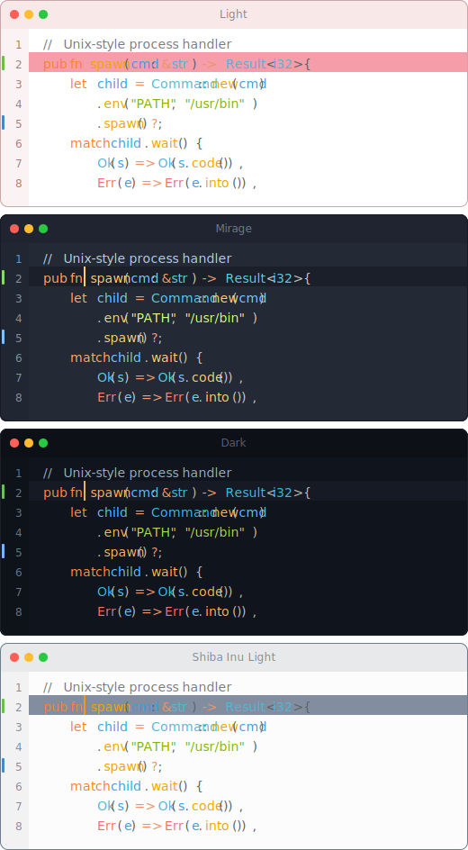
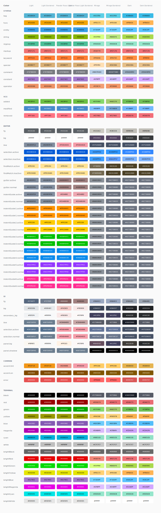

# ayu colors

The color palette from the [ayu theme](https://github.com/ayu-theme/ayu) as an npm package.

## Usage

```typescript
import { dark, light, mirage } from 'ayu'

// Access colors
dark.syntax.keyword.hex()    // '#FF8F40'
light.editor.bg.hex()        // '#FCFCFC'
mirage.common.accent.hex()   // '#FFCC66'

// RGB values
dark.syntax.string.rgb()     // [170, 217, 76]
```

## Palette



<details>
  <summary>Full palette</summary>

  
</details>

## Ports

* [VS Code](https://github.com/ayu-theme/vscode-ayu)
* [Sublime Text](https://github.com/ayu-theme/ayu)

## License

MIT

## Develop
- 执行 npm install，会安装依赖的 node modules
- 执行 npm run build （调用 tsc，输出到 dist/，包括 colors.js/color.js 与类型定义）。
- 可选资源：npm run svg 会先 build，再产出 colors.svg 和 palette.svg。
- 验证：npm test 会在 build 后运行 Node test（dist/test.js）。
